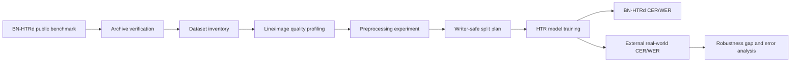
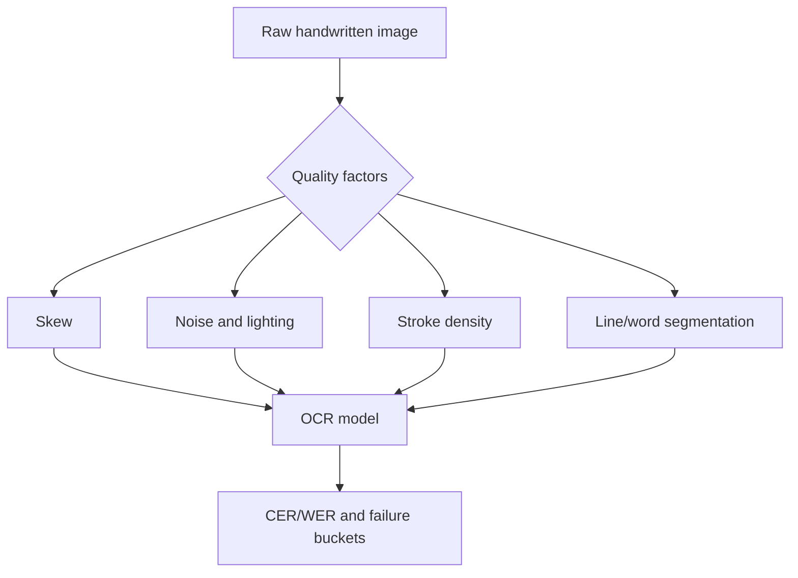
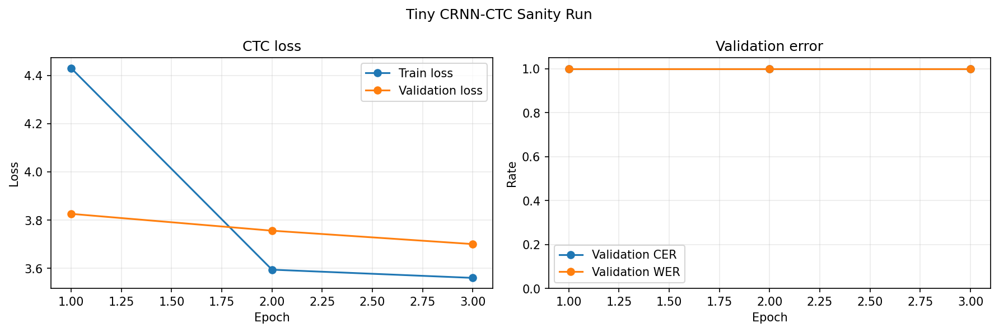
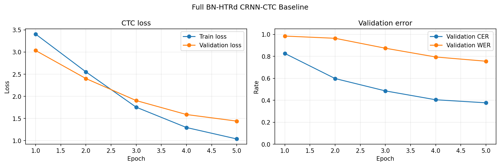

# Cross-Dataset Robustness of Bangla Handwritten Text Recognition

This repository is a reproducible thesis/report workspace for evaluating how Bangla handwritten text recognition (HTR) systems behave when models trained on public benchmark data are tested against messier real-world handwriting.

The repository itself is the live manuscript: methods, computed results, plots, limitations, and next steps are all in this README. The implementation is designed for Apple Silicon using `uv` and a native `macos-aarch64` Python runtime.

## Status at a Glance

| Area | Current status |
|---|---|
| Dataset download | Official Mendeley BN-HTRd v4 archives downloaded locally |
| Integrity checks | All four downloaded Mendeley files pass size and SHA-256 checks |
| HF split | Metadata accessible, ZIP blocked by gated authorization |
| Sample extraction | `Sample_Small.zip` extracted and profiled |
| Image analysis | 359 line/word images profiled |
| Preprocessing analysis | 120 images processed and compared |
| Line labels | Built from verified local Mendeley BN-HTRd archive |
| Tiny OCR sanity run | Completed on 300 training lines |
| First thesis OCR baseline | Completed on full local BN-HTRd line split |
| Current in-domain test result | CRNN-CTC raw-line baseline: **CER 27.76%**, **WER 66.86%** |

## Research Question

How robust are Bangla HTR models trained on BN-HTRd when evaluated outside their original benchmark distribution?

The thesis contribution is framed around robustness rather than simply building another OCR model:

- quantify the dataset gap between BN-HTRd and real-world handwritten Bangla images;
- control the training/evaluation protocol so external performance is meaningful;
- analyze which image-quality factors are likely to drive recognition failure;
- prepare an annotation and evaluation workflow for a 300-500 line real-world external test set.

## Methodology





## Environment

- Machine: Apple Silicon (`arm64`)
- Python: uv-managed CPython `3.11.15`
- Package manager: `uv`
- Core libraries: OpenCV, Pillow, NumPy, pandas, matplotlib, Hugging Face Hub

Reproduce the current results:

```bash
uv python install 3.11
uv python pin 3.11
uv sync
uv run atika-htr all
uv run python scripts/build_line_dataset.py
uv run python scripts/train_crnn_ctc.py --run-name crnn_ctc_tiny --epochs 3 --batch-size 8 --image-width 384 --max-train-rows 300 --max-val-rows 100 --max-test-rows 100 --device cpu
uv run python scripts/train_crnn_ctc.py --run-name crnn_ctc_full_baseline --epochs 5 --batch-size 16 --image-width 384 --device cpu
```

## Dataset Status

The official Mendeley BN-HTRd v4 files were downloaded and verified by SHA-256. Raw datasets are intentionally excluded from GitHub because they are large and should be retrieved from the original source.

### Archive Inventory

| archive                  |   members | uncompressed_size   |    jpg |   txt |   xlsx |   xml |   pdf |
|:-------------------------|----------:|:--------------------|-------:|------:|-------:|------:|------:|
| Automatic_Annotation.zip |    154374 | 1.8 GB              | 121572 | 15694 |      0 |     0 |    61 |
| BN-HTR_Dataset.zip       |    185856 | 2.5 GB              | 137721 | 16256 |    150 | 15168 |   127 |
| Sample_Small.zip         |      4378 | 77.4 MB             |   3225 |   387 |      3 |   360 |     3 |

### Download Verification

| file                       | actual_size   | size_ok   | sha256_ok   |
|:---------------------------|:--------------|:----------|:------------|
| Automatic_Annotation.zip   | 1.7 GB        | True      | True        |
| BN-HTR_Dataset.zip         | 2.4 GB        | True      | True        |
| Sample_Small.zip           | 72.6 MB       | True      | True        |
| Structure_of_Directory.pdf | 40.1 KB       | True      | True        |

Hugging Face split status:

- Repository: `shaoncsecu/BN-HTRd_Splitted`
- Status: `blocked`
- Reason: 403 GatedRepoError: token account is not authorized for BN-HTRd_Split.zip
- Next action: Visit https://huggingface.co/datasets/shaoncsecu/BN-HTRd_Splitted and request access, or continue with verified Mendeley v4 archives.

## Computed Preliminary Results

From the extracted `Sample_Small.zip` subset:

- Files extracted/profiled: **3,985**
- JPEG images: **3,225**
- Text files: **387**
- XML annotation files: **360**
- Ground-truth documents: **3**
- Ground-truth words: **2,363**
- Line/word images profiled: **359**
- Images preprocessed for comparison: **120**

Image profile summary:

- Width mean/median/min/max: `{'mean': 1893.8217270194987, 'median': 2048.0, 'min': 313.0, 'max': 2448.0}`
- Height mean/median/min/max: `{'mean': 408.5877437325905, 'median': 217.0, 'min': 81.0, 'max': 3946.0}`
- Otsu ink-fraction mean/median/min/max: `{'mean': 0.06924565867286134, 'median': 0.06525888166947864, 'min': 0.011912828279900284, 'max': 0.16321237061977803}`

### Ground-Truth Text Sample

The small public sample contains three ground-truth document text files. This confirms that the local workflow can read Bangla text metadata and produce document-level text statistics.

|   doc_id | file                                                              |   characters_no_space |   words |   lines |   unique_chars |
|---------:|:------------------------------------------------------------------|----------------------:|--------:|--------:|---------------:|
|        1 | data/work/Sample_Small/Recognition_Ground_Truth_Texts/1/1.txt     |                  1454 |     231 |      20 |             64 |
|      100 | data/work/Sample_Small/Recognition_Ground_Truth_Texts/100/100.txt |                  8592 |    1708 |      66 |             87 |
|       50 | data/work/Sample_Small/Recognition_Ground_Truth_Texts/50/50.txt   |                  2377 |     424 |      33 |             83 |

### Image Quality Metrics

The image profile table below is computed over 359 sample line/word JPEGs. `laplacian_var` is used as a simple sharpness/edge-detail proxy, while `otsu_ink_fraction` approximates foreground stroke density after Otsu thresholding.

|       |    width |   height |   aspect_ratio |   mean_intensity |   std_intensity |   laplacian_var |   dark_fraction |   otsu_ink_fraction |
|:------|---------:|---------:|---------------:|-----------------:|----------------:|----------------:|----------------:|--------------------:|
| count |  359     |  359     |        359     |          359     |         359     |         359     |         359     |             359     |
| mean  | 1893.82  |  408.588 |          8.543 |          237.953 |          55.449 |        1017.38  |           0.054 |               0.069 |
| std   |  456.712 |  740.88  |          3.971 |            5.444 |           8.167 |         355.266 |           0.018 |               0.02  |
| min   |  313     |   81     |          0.609 |          213.361 |          24.915 |         130.573 |           0.009 |               0.012 |
| 25%   | 1874.5   |  161     |          5.922 |          235.62  |          49.994 |         771.047 |           0.042 |               0.057 |
| 50%   | 2048     |  217     |          7.951 |          239.206 |          54.125 |         971.88  |           0.05  |               0.065 |
| 75%   | 2161.5   |  299.5   |         10.899 |          241.368 |          60.098 |        1162.96  |           0.062 |               0.078 |
| max   | 2448     | 3946     |         21.19  |          251.877 |          82.673 |        2840.56  |           0.135 |               0.163 |

Interpretation:

- The median line/image width is **2048 px**, but heights vary widely, which means the sample mixes normal line images with taller crops or page-like fragments.
- The median estimated ink fraction is about **0.065**, so most images are sparse foreground on bright background.
- The max height of **3946 px** is a warning that training code must filter or normalize image aspect ratios before batching.

### Preprocessing Results

Preprocessing used denoising, CLAHE contrast enhancement, and adaptive thresholding. The goal here is not to claim OCR improvement yet; it is to measure how much the preprocessing changes image structure before model training.

|       |   raw_mean |   processed_mean |   raw_laplacian_var |   processed_laplacian_var |   raw_ink_fraction |   processed_ink_fraction |
|:------|-----------:|-----------------:|--------------------:|--------------------------:|-------------------:|-------------------------:|
| count |    120     |          120     |             120     |                    120    |            120     |                  120     |
| mean  |    236.192 |          233.95  |            1041.39  |                   7674.62 |              0.084 |                    0.083 |
| std   |      6.688 |            6.722 |             432.193 |                   2118.17 |              0.028 |                    0.026 |
| min   |    213.576 |          209.743 |             442.647 |                   4528.92 |              0.047 |                    0.046 |
| 25%   |    231.6   |          230.029 |             764.011 |                   6248.99 |              0.064 |                    0.063 |
| 50%   |    238.495 |          236.042 |             948.699 |                   7343.09 |              0.075 |                    0.074 |
| 75%   |    241.252 |          238.9   |            1244.08  |                   8589.02 |              0.1   |                    0.098 |
| max   |    244.798 |          243.391 |            2840.56  |                  14952.7  |              0.189 |                    0.177 |

Mean preprocessing shifts:

- Raw Laplacian variance: **1041.3924**
- Processed Laplacian variance: **7674.6252**
- Raw ink fraction: **0.0843**
- Processed ink fraction: **0.0825**

Interpretation:

- Edge/detail variance increases strongly after preprocessing, which is expected after binarization.
- Mean ink fraction stays close to the raw estimate, so preprocessing is not simply flooding the image with foreground.
- This preprocessing should be treated as an experimental condition, not a default: OCR models must be evaluated on raw and processed versions separately.

## Line-Level Dataset Build

The first requested blocker is now resolved. The workflow extracts only the needed directories from the verified Mendeley archive, reads the recognition ground-truth spreadsheets, reconstructs line text from word-level records, matches each line to its JPEG crop, and writes document-safe train/validation/test splits.

Generated local files:

```text
data/processed/bn_htrd_lines/
├── labels.csv
├── train.csv
├── val.csv
├── test.csv
├── vocab.json
├── missing_line_images.csv
└── summary.json
```

Dataset summary:

| Metric | Value |
|---|---:|
| Matched labeled line images | 14,113 |
| Source documents | 148 |
| Pages | 768 |
| Missing expected line images | 273 |
| Character vocabulary, including CTC blank | 170 |
| Maximum label length | 86 chars |
| Mean label length | 43.07 chars |

Split summary:

| split   |   rows |   documents |   mean_chars |
|:--------|-------:|------------:|-------------:|
| train   |   9664 |         103 |        42.85 |
| val     |   2221 |          22 |        44.61 |
| test    |   2228 |          23 |        42.49 |

The split is document-safe, so lines from the same source document do not appear across train, validation, and test. The 273 missing line images are recorded in `data/processed/bn_htrd_lines/missing_line_images.csv` and excluded from training/evaluation.

## OCR Experiments

The OCR model is a compact CRNN-CTC baseline: four convolution blocks, a two-layer bidirectional LSTM, character-level CTC output, greedy CTC decoding, and CER/WER evaluation. PyTorch detects Apple Silicon MPS on this machine, but `CTCLoss` is not implemented for MPS in the current PyTorch build, so these CTC runs use CPU for correctness and reproducibility.

### Tiny Sanity Baseline

Command:

```bash
uv run python scripts/train_crnn_ctc.py --run-name crnn_ctc_tiny --epochs 3 --batch-size 8 --image-width 384 --max-train-rows 300 --max-val-rows 100 --max-test-rows 100 --device cpu
```

Results:

| Metric | Value |
|---|---:|
| Training lines | 300 |
| Validation lines | 100 |
| Test lines | 100 |
| Runtime | 11.7 sec |
| Test CTC loss | 3.6465 |
| Test CER | 100.00% |
| Test WER | 100.00% |

Training history:

|   epoch |   train_loss |   val_loss |   val_cer |   val_wer |   val_batches |
|--------:|-------------:|-----------:|----------:|----------:|--------------:|
|       1 |       4.4301 |     3.8259 |         1 |         1 |            13 |
|       2 |       3.5944 |     3.7562 |         1 |         1 |            13 |
|       3 |       3.5604 |     3.7006 |         1 |         1 |            13 |

Interpretation: this deliberately tiny 300-line, 3-epoch run verifies that labels load, line images batch correctly, the Bangla character vocabulary is usable, and CTC loss decreases. It still decodes blank strings on the test examples, so it is a wiring sanity check, not an accuracy result.

### Full BN-HTRd Baseline

Command:

```bash
uv run python scripts/train_crnn_ctc.py --run-name crnn_ctc_full_baseline --epochs 5 --batch-size 16 --image-width 384 --device cpu
```

Results:

| Metric | Value |
|---|---:|
| Training lines | 9,664 |
| Validation lines | 2,221 |
| Test lines | 2,228 |
| Runtime | 9.8 min |
| Test CTC loss | 1.0354 |
| Test CER | **27.76%** |
| Test WER | **66.86%** |

Training history:

|   epoch |   train_loss |   val_loss |   val_cer |   val_wer |   val_batches |
|--------:|-------------:|-----------:|----------:|----------:|--------------:|
|       1 |       3.4059 |     3.0355 |    0.8262 |    0.9842 |           139 |
|       2 |       2.5533 |     2.4023 |    0.5975 |    0.9639 |           139 |
|       3 |       1.7557 |     1.905  |    0.485  |    0.8735 |           139 |
|       4 |       1.2965 |     1.59   |    0.4044 |    0.7937 |           139 |
|       5 |       1.0387 |     1.4414 |    0.3767 |    0.7552 |           139 |

Representative predictions:

|   line_id | truth                                                 | pred                                              |
|----------:|:------------------------------------------------------|:--------------------------------------------------|
|     7_1_1 | বিশেষ সম্পাদকীয়                                       | বিশেষ সমদকয়                                      |
|     7_1_2 | চট্টগ্রামবাসীর পাশে দাঁড়াতে হবে বিগ বিজনেস            | দটপ্রামবাসর পাশে দাড়াতে হবে কি বিজনেস            |
|     7_1_3 | হাউসগুলোকে শুরুর দিকে কিছুটা ধীর গতিতে                | হাউসগুলোকে শরুর দিকে কিুটা ধীর গতিতে              |
|     7_1_4 | সংক্রমণ ছড়ালেও চট্টগ্রাম ইতিমধ্যেই করোনার হটস্পট      | সংক্রমণ ছডালেও সপ্রাম ইতিনধ্যেই করোনার হসট        |
|     7_1_5 | হিসেবে নজরে চলে এসেছে । দিন যতো গড়াচ্ছে , চট্টগ্রামে  | হিসেবে জরে চলে তবেছে । দিন যতে গরাদ্ছে স্রগ্রমে   |
|     7_1_6 | করোনার চিকিৎসার নাজুক চিত্রই বেশ ভালভাবেই ফুটে        | করোনার দিকিংসার নাস্ুক ভিই কেশ ভালতাবেই মুধে      |
|     7_1_7 | ওঠছে ।                                                | জজছে ।                                            |
|     7_1_8 | প্রাপ্ত তথ্যমতে , চট্টগ্রামের চারটি হাসপাতালে পুরোদমে | প্রক্তে তথ্যমাজে , সটগ্ামের চরটি হাসাপতালে পরোদমে |

Interpretation: the full run learns a real recognizer and produces non-blank Bangla predictions. Validation CER improves from **82.62%** to **37.67%** over five epochs, and validation loss is still falling at epoch 5. This is a first thesis baseline, not a final model; longer training, better width handling, stronger augmentations, and a preprocessing condition should all be evaluated next.

## Figures


Figure 1. Sample image width and ink-density distributions. These measurements help identify whether the public benchmark contains layout and stroke-density variation that should be controlled during training and evaluation.


Figure 2. Estimated ink-density shift after preprocessing. This is a first diagnostic for whether binarization/contrast normalization is changing image structure enough to affect recognition.


Figure 3. Raw vs processed sample line images. This figure makes the preprocessing effect inspectable instead of only numeric.



Figure 4. Tiny sanity-run CTC loss and validation CER/WER. Loss decreases, but greedy decoding remains blank after three short epochs.



Figure 5. Full BN-HTRd CRNN-CTC baseline. Validation loss, CER, and WER improve across all five epochs.

## What We Should Do Next

The next useful work is to improve the baseline and add the external robustness test. The first three requested milestones are now complete: line labels/splits, a tiny OCR sanity run, and a full in-domain CRNN-CTC baseline.

### Step 4: Improve the in-domain baseline

- Train the CRNN-CTC baseline for more epochs with early stopping.
- Compare raw images against the preprocessing pipeline as a separate condition.
- Add width bucketing or dynamic-width batches so long lines are not compressed as aggressively.
- Add light geometric/contrast augmentation that matches real handwriting noise.

### Step 5: Prepare the external real-world test set

For the 2703 real-world images, the most thesis-useful subset is:

- 300-500 manually annotated line images;
- stratified by clean/noisy/skewed/low-contrast/dense handwriting;
- never used for training;
- evaluated only after model choices are fixed.

### Step 6: Report the robustness gap

The core thesis result should be a table like:

| Model | Training data | Test data | Preprocessing | CER | WER | Robustness drop |
|---|---|---|---|---:|---:|---:|
| CRNN-CTC | BN-HTRd train | BN-HTRd test | Raw | 27.76% | 66.86% | baseline |
| CRNN-CTC | BN-HTRd train | External subset | Raw | TBD | TBD | TBD |
| CRNN-CTC | BN-HTRd train | BN-HTRd test | Processed | TBD | TBD | TBD |
| CRNN-CTC | BN-HTRd train | External subset | Processed | TBD | TBD | TBD |

## Methodological Notes

The current run produces preliminary dataset, preprocessing, and first OCR baseline results. The recommended experimental ladder from here is:

1. Extend the CRNN-CTC run until validation CER plateaus.
2. Rerun the baseline with preprocessing and augmentation as controlled ablations.
3. Fine-tune one stronger transformer or grapheme-tokenized model.
4. Annotate 300-500 external real-world line images.
5. Report the in-domain BN-HTRd CER/WER, external CER/WER, and robustness drop.
6. Break errors down by quality bucket: skew, noise, lighting, stroke density, and segmentation defects.

## Repository Layout

```text
src/atika_htr/cli.py                 Reproducible analysis CLI
scripts/download_hf_split.py         HF gated split downloader, token read from stdin
scripts/build_line_dataset.py        BN-HTRd line label and split builder
scripts/train_crnn_ctc.py            CRNN-CTC sanity/full baseline trainer
scripts/write_public_readme.py       README manuscript generator
results/                            Generated result tables and figures
```

Raw data folders such as `datasets/` and `data/` are ignored by git.

## Citation Pointers

- BN-HTRd dataset DOI: `10.17632/743k6dm543.4`
- Original BN-HTRd paper: `arXiv:2206.08977`
- BN-DRISHTI model/demo repository: `crusnic-corp/BN-DRISHTI`

## Current Limitation

The Hugging Face `BN-HTRd_Splitted` archive is gated. The supplied token was not authorized for the ZIP, so this repository uses the verified public Mendeley archives and records the gated-access state in `results/hf_access_status.json`. Model checkpoints are excluded from GitHub; metrics, histories, prediction examples, scripts, and plots are published.
