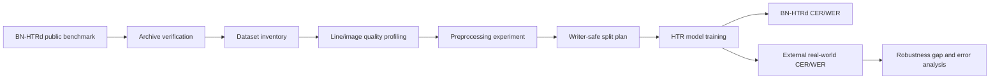
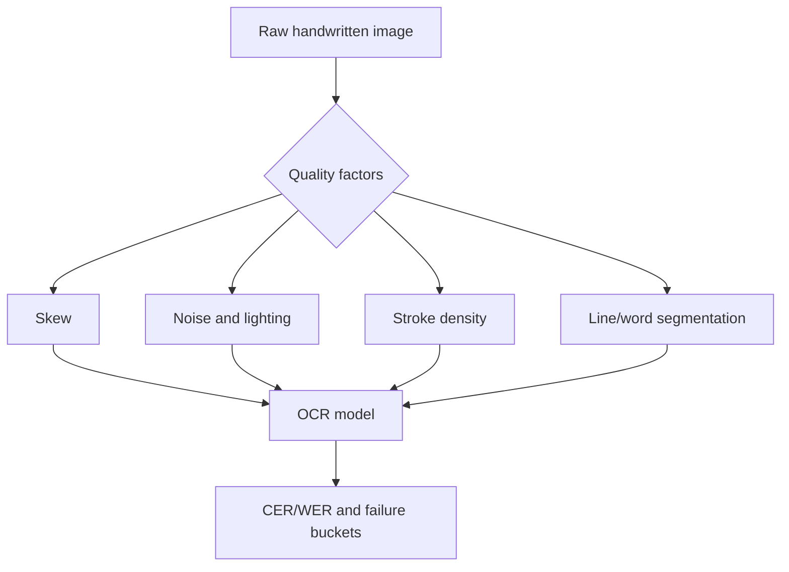
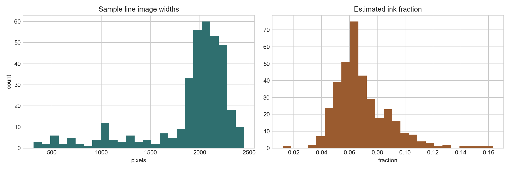
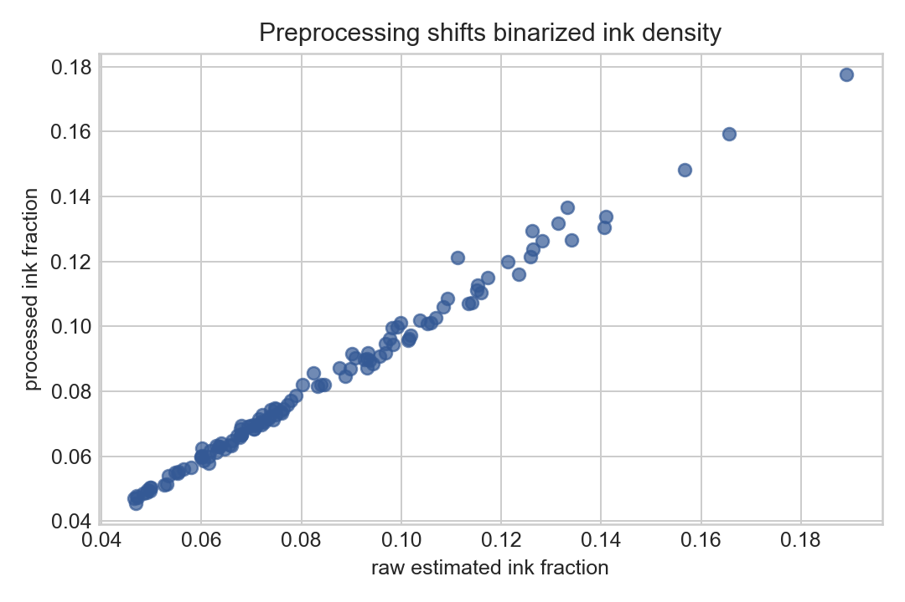
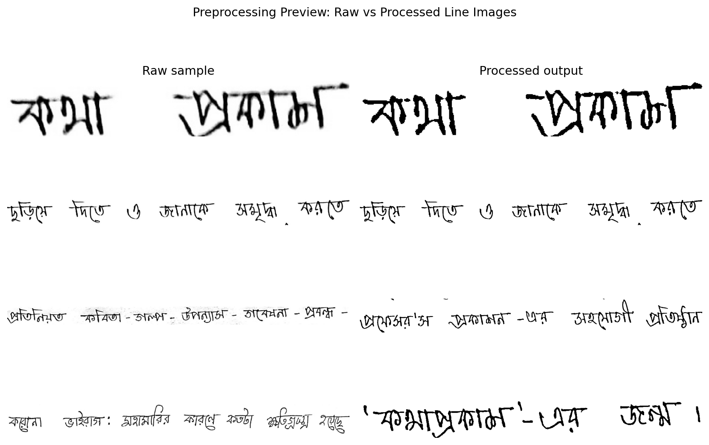

# Cross-Dataset Robustness of Bangla Handwritten Text Recognition

This repository is a reproducible thesis/report workspace for evaluating how Bangla handwritten text recognition (HTR) systems behave when models trained on public benchmark data are tested against messier real-world handwriting.

The repository itself is the live manuscript: methods, computed results, plots, limitations, and next steps are all in this README. The implementation is designed for Apple Silicon using `uv` and a native `macos-aarch64` Python runtime.

## Status at a Glance

| Area | Current status |
|---|---|
| Dataset download | Official Mendeley BN-HTRd v4 archives downloaded locally |
| Integrity checks | All four downloaded Mendeley files pass size and SHA-256 checks |
| HF split | Metadata accessible, ZIP blocked by gated authorization |
| Sample extraction | `Sample_Small.zip` extracted and profiled |
| Image analysis | 359 line/word images profiled |
| Preprocessing analysis | 120 images processed and compared |
| OCR CER/WER | Not run yet; needs line-label conversion and model training |

## Research Question

How robust are Bangla HTR models trained on BN-HTRd when evaluated outside their original benchmark distribution?

The thesis contribution is framed around robustness rather than simply building another OCR model:

- quantify the dataset gap between BN-HTRd and real-world handwritten Bangla images;
- control the training/evaluation protocol so external performance is meaningful;
- analyze which image-quality factors are likely to drive recognition failure;
- prepare an annotation and evaluation workflow for a 300-500 line real-world external test set.

## Methodology





## Environment

- Machine: Apple Silicon (`arm64`)
- Python: uv-managed CPython `3.11.15`
- Package manager: `uv`
- Core libraries: OpenCV, Pillow, NumPy, pandas, matplotlib, Hugging Face Hub

Reproduce the current results:

```bash
uv python install 3.11
uv python pin 3.11
uv sync
uv run atika-htr all
```

## Dataset Status

The official Mendeley BN-HTRd v4 files were downloaded and verified by SHA-256. Raw datasets are intentionally excluded from GitHub because they are large and should be retrieved from the original source.

### Archive Inventory

| archive                  |   members | uncompressed_size   |    jpg |   txt |   xlsx |   xml |   pdf |
|:-------------------------|----------:|:--------------------|-------:|------:|-------:|------:|------:|
| Automatic_Annotation.zip |    154374 | 1.8 GB              | 121572 | 15694 |      0 |     0 |    61 |
| BN-HTR_Dataset.zip       |    185856 | 2.5 GB              | 137721 | 16256 |    150 | 15168 |   127 |
| Sample_Small.zip         |      4378 | 77.4 MB             |   3225 |   387 |      3 |   360 |     3 |

### Download Verification

| file                       | actual_size   | size_ok   | sha256_ok   |
|:---------------------------|:--------------|:----------|:------------|
| Automatic_Annotation.zip   | 1.7 GB        | True      | True        |
| BN-HTR_Dataset.zip         | 2.4 GB        | True      | True        |
| Sample_Small.zip           | 72.6 MB       | True      | True        |
| Structure_of_Directory.pdf | 40.1 KB       | True      | True        |

Hugging Face split status:

- Repository: `shaoncsecu/BN-HTRd_Splitted`
- Status: `blocked`
- Reason: 403 GatedRepoError: token account is not authorized for BN-HTRd_Split.zip
- Next action: Visit https://huggingface.co/datasets/shaoncsecu/BN-HTRd_Splitted and request access, or continue with verified Mendeley v4 archives.

## Computed Preliminary Results

From the extracted `Sample_Small.zip` subset:

- Files extracted/profiled: **3,985**
- JPEG images: **3,225**
- Text files: **387**
- XML annotation files: **360**
- Ground-truth documents: **3**
- Ground-truth words: **2,363**
- Line/word images profiled: **359**
- Images preprocessed for comparison: **120**

Image profile summary:

- Width mean/median/min/max: `{'mean': 1893.8217270194987, 'median': 2048.0, 'min': 313.0, 'max': 2448.0}`
- Height mean/median/min/max: `{'mean': 408.5877437325905, 'median': 217.0, 'min': 81.0, 'max': 3946.0}`
- Otsu ink-fraction mean/median/min/max: `{'mean': 0.06924565867286134, 'median': 0.06525888166947864, 'min': 0.011912828279900284, 'max': 0.16321237061977803}`

### Ground-Truth Text Sample

The small public sample contains three ground-truth document text files. This confirms that the local workflow can read Bangla text metadata and produce document-level text statistics.

|   doc_id | file                                                              |   characters_no_space |   words |   lines |   unique_chars |
|---------:|:------------------------------------------------------------------|----------------------:|--------:|--------:|---------------:|
|        1 | data/work/Sample_Small/Recognition_Ground_Truth_Texts/1/1.txt     |                  1454 |     231 |      20 |             64 |
|      100 | data/work/Sample_Small/Recognition_Ground_Truth_Texts/100/100.txt |                  8592 |    1708 |      66 |             87 |
|       50 | data/work/Sample_Small/Recognition_Ground_Truth_Texts/50/50.txt   |                  2377 |     424 |      33 |             83 |

### Image Quality Metrics

The image profile table below is computed over 359 sample line/word JPEGs. `laplacian_var` is used as a simple sharpness/edge-detail proxy, while `otsu_ink_fraction` approximates foreground stroke density after Otsu thresholding.

|       |    width |   height |   aspect_ratio |   mean_intensity |   std_intensity |   laplacian_var |   dark_fraction |   otsu_ink_fraction |
|:------|---------:|---------:|---------------:|-----------------:|----------------:|----------------:|----------------:|--------------------:|
| count |  359     |  359     |        359     |          359     |         359     |         359     |         359     |             359     |
| mean  | 1893.82  |  408.588 |          8.543 |          237.953 |          55.449 |        1017.38  |           0.054 |               0.069 |
| std   |  456.712 |  740.88  |          3.971 |            5.444 |           8.167 |         355.266 |           0.018 |               0.02  |
| min   |  313     |   81     |          0.609 |          213.361 |          24.915 |         130.573 |           0.009 |               0.012 |
| 25%   | 1874.5   |  161     |          5.922 |          235.62  |          49.994 |         771.047 |           0.042 |               0.057 |
| 50%   | 2048     |  217     |          7.951 |          239.206 |          54.125 |         971.88  |           0.05  |               0.065 |
| 75%   | 2161.5   |  299.5   |         10.899 |          241.368 |          60.098 |        1162.96  |           0.062 |               0.078 |
| max   | 2448     | 3946     |         21.19  |          251.877 |          82.673 |        2840.56  |           0.135 |               0.163 |

Interpretation:

- The median line/image width is **2048 px**, but heights vary widely, which means the sample mixes normal line images with taller crops or page-like fragments.
- The median estimated ink fraction is about **0.065**, so most images are sparse foreground on bright background.
- The max height of **3946 px** is a warning that training code must filter or normalize image aspect ratios before batching.

### Preprocessing Results

Preprocessing used denoising, CLAHE contrast enhancement, and adaptive thresholding. The goal here is not to claim OCR improvement yet; it is to measure how much the preprocessing changes image structure before model training.

|       |   raw_mean |   processed_mean |   raw_laplacian_var |   processed_laplacian_var |   raw_ink_fraction |   processed_ink_fraction |
|:------|-----------:|-----------------:|--------------------:|--------------------------:|-------------------:|-------------------------:|
| count |    120     |          120     |             120     |                    120    |            120     |                  120     |
| mean  |    236.192 |          233.95  |            1041.39  |                   7674.62 |              0.084 |                    0.083 |
| std   |      6.688 |            6.722 |             432.193 |                   2118.17 |              0.028 |                    0.026 |
| min   |    213.576 |          209.743 |             442.647 |                   4528.92 |              0.047 |                    0.046 |
| 25%   |    231.6   |          230.029 |             764.011 |                   6248.99 |              0.064 |                    0.063 |
| 50%   |    238.495 |          236.042 |             948.699 |                   7343.09 |              0.075 |                    0.074 |
| 75%   |    241.252 |          238.9   |            1244.08  |                   8589.02 |              0.1   |                    0.098 |
| max   |    244.798 |          243.391 |            2840.56  |                  14952.7  |              0.189 |                    0.177 |

Mean preprocessing shifts:

- Raw Laplacian variance: **1041.3924**
- Processed Laplacian variance: **7674.6252**
- Raw ink fraction: **0.0843**
- Processed ink fraction: **0.0825**

Interpretation:

- Edge/detail variance increases strongly after preprocessing, which is expected after binarization.
- Mean ink fraction stays close to the raw estimate, so preprocessing is not simply flooding the image with foreground.
- This preprocessing should be treated as an experimental condition, not a default: OCR models must be evaluated on raw and processed versions separately.

## Figures



Figure 1. Sample image width and ink-density distributions. These measurements help identify whether the public benchmark contains layout and stroke-density variation that should be controlled during training and evaluation.



Figure 2. Estimated ink-density shift after preprocessing. This is a first diagnostic for whether binarization/contrast normalization is changing image structure enough to affect recognition.



Figure 3. Raw vs processed sample line images. This figure makes the preprocessing effect inspectable instead of only numeric.

## What We Should Do Next

The next useful work is not more packaging. It is to produce the first real OCR baseline and a valid evaluation protocol.

### Step 1: Build line-level labels from the local Mendeley archive

The Mendeley archives are available and verified. Since the Hugging Face split ZIP is gated, the practical route is to extract the full `BN-HTR_Dataset.zip`, parse the line-level XML/TXT structure, and create:

```text
data/processed/bn_htrd_lines/
├── images/
├── labels.csv
├── train.csv
├── val.csv
└── test.csv
```

The split must be writer/document safe. We should avoid putting line images from the same source document into both train and test.

### Step 2: Run a tiny sanity OCR experiment

Before training a large model, run a deliberately small baseline:

- 100-300 line images;
- character or grapheme vocabulary built from labels;
- CRNN + CTC;
- 1-3 quick epochs on Apple Silicon CPU/MPS if available;
- report whether loss decreases and whether decoding works.

This catches label/path/tokenization problems early.

### Step 3: Scale to the first thesis baseline

Once the tiny run works:

- train CRNN-CTC on the full line-level split;
- evaluate CER/WER on BN-HTRd test;
- rerun with preprocessing as a separate condition;
- save predictions, errors, and confusion examples.

### Step 4: Prepare the external real-world test set

For the 2703 real-world images, the most thesis-useful subset is:

- 300-500 manually annotated line images;
- stratified by clean/noisy/skewed/low-contrast/dense handwriting;
- never used for training;
- evaluated only after model choices are fixed.

### Step 5: Report the robustness gap

The core thesis result should be a table like:

| Model | Training data | Test data | Preprocessing | CER | WER | Robustness drop |
|---|---|---|---|---:|---:|---:|
| CRNN-CTC | BN-HTRd train | BN-HTRd test | Raw | TBD | TBD | baseline |
| CRNN-CTC | BN-HTRd train | External subset | Raw | TBD | TBD | TBD |
| CRNN-CTC | BN-HTRd train | BN-HTRd test | Processed | TBD | TBD | TBD |
| CRNN-CTC | BN-HTRd train | External subset | Processed | TBD | TBD | TBD |

## Methodological Notes

The current run produces preliminary dataset and preprocessing results, not final OCR accuracy. Final CER/WER requires a trained OCR model and clean line-level ground truth. The recommended experimental ladder is:

1. Create writer-safe train/validation/test splits for BN-HTRd.
2. Train a compact baseline model such as CRNN-CTC on line-level images.
3. Fine-tune one stronger transformer or grapheme-tokenized model.
4. Annotate 300-500 external real-world line images.
5. Report the in-domain BN-HTRd CER/WER, external CER/WER, and robustness drop.
6. Break errors down by quality bucket: skew, noise, lighting, stroke density, and segmentation defects.

## Repository Layout

```text
src/atika_htr/cli.py                 Reproducible analysis CLI
scripts/download_hf_split.py         HF gated split downloader, token read from stdin
scripts/write_public_readme.py       README manuscript generator
results/                            Generated result tables and figures
```

Raw data folders such as `datasets/` and `data/` are ignored by git.

## Citation Pointers

- BN-HTRd dataset DOI: `10.17632/743k6dm543.4`
- Original BN-HTRd paper: `arXiv:2206.08977`
- BN-DRISHTI model/demo repository: `crusnic-corp/BN-DRISHTI`

## Current Limitation

The Hugging Face `BN-HTRd_Splitted` archive is gated. The supplied token was not authorized for the ZIP, so this repository uses the verified public Mendeley archives and records the gated-access state in `results/hf_access_status.json`.
