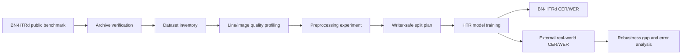
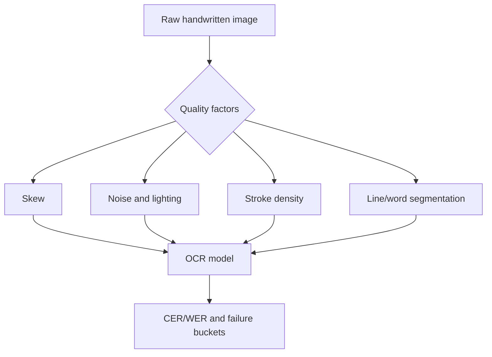

# Cross-Dataset Robustness of Bangla Handwritten Text Recognition

This repository is a reproducible thesis/report workspace for evaluating how Bangla handwritten text recognition (HTR) systems behave when models trained on public benchmark data are tested against messier real-world handwriting.

The current implementation focuses on dataset acquisition, verification, inventory, image-quality analysis, preprocessing experiments, split planning, and manuscript-ready reporting. It is designed for Apple Silicon using `uv` and a native `macos-aarch64` Python runtime.

## Research Question

How robust are Bangla HTR models trained on BN-HTRd when evaluated outside their original benchmark distribution?

The thesis contribution is framed around robustness rather than simply building another OCR model:

- quantify the dataset gap between BN-HTRd and real-world handwritten Bangla images;
- control the training/evaluation protocol so external performance is meaningful;
- analyze which image-quality factors are likely to drive recognition failure;
- prepare an annotation and evaluation workflow for a 300-500 line real-world external test set.

## Methodology





## Environment

- Machine: Apple Silicon (`arm64`)
- Python: uv-managed CPython `3.11.15`
- Package manager: `uv`
- Core libraries: OpenCV, Pillow, NumPy, pandas, matplotlib, Hugging Face Hub

Reproduce the current results:

```bash
uv python install 3.11
uv python pin 3.11
uv sync
uv run atika-htr all
```

## Dataset Status

The official Mendeley BN-HTRd v4 files were downloaded and verified by SHA-256. Raw datasets are intentionally excluded from GitHub because they are large and should be retrieved from the original source.

| archive                  |   members | uncompressed_size   |    jpg |   txt |   xlsx |   xml |   pdf |
|:-------------------------|----------:|:--------------------|-------:|------:|-------:|------:|------:|
| Automatic_Annotation.zip |    154374 | 1.8 GB              | 121572 | 15694 |      0 |     0 |    61 |
| BN-HTR_Dataset.zip       |    185856 | 2.5 GB              | 137721 | 16256 |    150 | 15168 |   127 |
| Sample_Small.zip         |      4378 | 77.4 MB             |   3225 |   387 |      3 |   360 |     3 |

Hugging Face split status:

- Repository: `shaoncsecu/BN-HTRd_Splitted`
- Status: `blocked`
- Reason: 403 GatedRepoError: token account is not authorized for BN-HTRd_Split.zip
- Next action: Visit https://huggingface.co/datasets/shaoncsecu/BN-HTRd_Splitted and request access, or continue with verified Mendeley v4 archives.

## Computed Preliminary Results

From the extracted `Sample_Small.zip` subset:

- Files extracted/profiled: **3,985**
- JPEG images: **3,225**
- Text files: **387**
- XML annotation files: **360**
- Ground-truth documents: **3**
- Ground-truth words: **2,363**
- Line/word images profiled: **359**
- Images preprocessed for comparison: **120**

Image profile summary:

- Width mean/median/min/max: `{'mean': 1893.8217270194987, 'median': 2048.0, 'min': 313.0, 'max': 2448.0}`
- Height mean/median/min/max: `{'mean': 408.5877437325905, 'median': 217.0, 'min': 81.0, 'max': 3946.0}`
- Otsu ink-fraction mean/median/min/max: `{'mean': 0.06924565867286134, 'median': 0.06525888166947864, 'min': 0.011912828279900284, 'max': 0.16321237061977803}`

## Figures


Figure 1. Sample image width and ink-density distributions. These measurements help identify whether the public benchmark contains layout and stroke-density variation that should be controlled during training and evaluation.


Figure 2. Estimated ink-density shift after preprocessing. This is a first diagnostic for whether binarization/contrast normalization is changing image structure enough to affect recognition.

## Methodological Notes

The current run produces preliminary dataset and preprocessing results, not final OCR accuracy. Final CER/WER requires a trained OCR model and clean line-level ground truth. The recommended experimental ladder is:

1. Create writer-safe train/validation/test splits for BN-HTRd.
2. Train a compact baseline model such as CRNN-CTC on line-level images.
3. Fine-tune one stronger transformer or grapheme-tokenized model.
4. Annotate 300-500 external real-world line images.
5. Report the in-domain BN-HTRd CER/WER, external CER/WER, and robustness drop.
6. Break errors down by quality bucket: skew, noise, lighting, stroke density, and segmentation defects.

## Repository Layout

```text
src/atika_htr/cli.py                 Reproducible analysis CLI
scripts/download_hf_split.py         HF gated split downloader, token read from stdin
scripts/write_public_readme.py       README manuscript generator
scripts/build_manuscript_docx.py     DOCX manuscript generator
results/                            Generated result tables and figures
```

Raw data folders such as `datasets/` and `data/` are ignored by git.

## Citation Pointers

- BN-HTRd dataset DOI: `10.17632/743k6dm543.4`
- Original BN-HTRd paper: `arXiv:2206.08977`
- BN-DRISHTI model/demo repository: `crusnic-corp/BN-DRISHTI`

## Current Limitation

The Hugging Face `BN-HTRd_Splitted` archive is gated. The supplied token was not authorized for the ZIP, so this repository uses the verified public Mendeley archives and records the gated-access state in `results/hf_access_status.json`.
